# Use
If you use any of these images or gifs for your own work, please cite the following paper:
```
Citation
```
Additionally, check out the documentation for our [EMG Library](https://eeddy.github.io/libemg/) to see how you can leverage these automatically from a Training UI. 

# Gestures

| ID  | Gesture Name | Photo | GIF |
| ------------- | ------------- | ------------- | ------------- |
| 1  | No Motion |    | 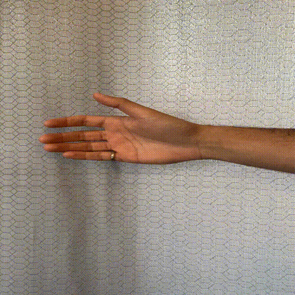 |
| 2  | Hand Close |    | 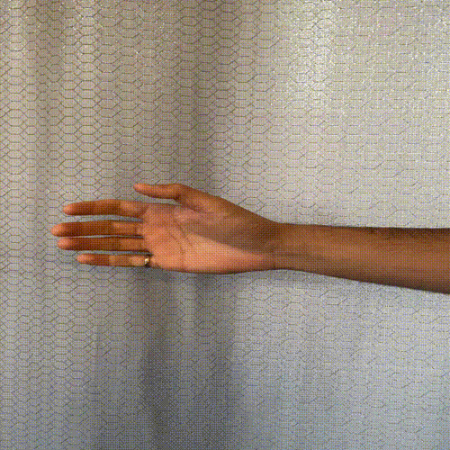   |
| 3  | Hand Open | 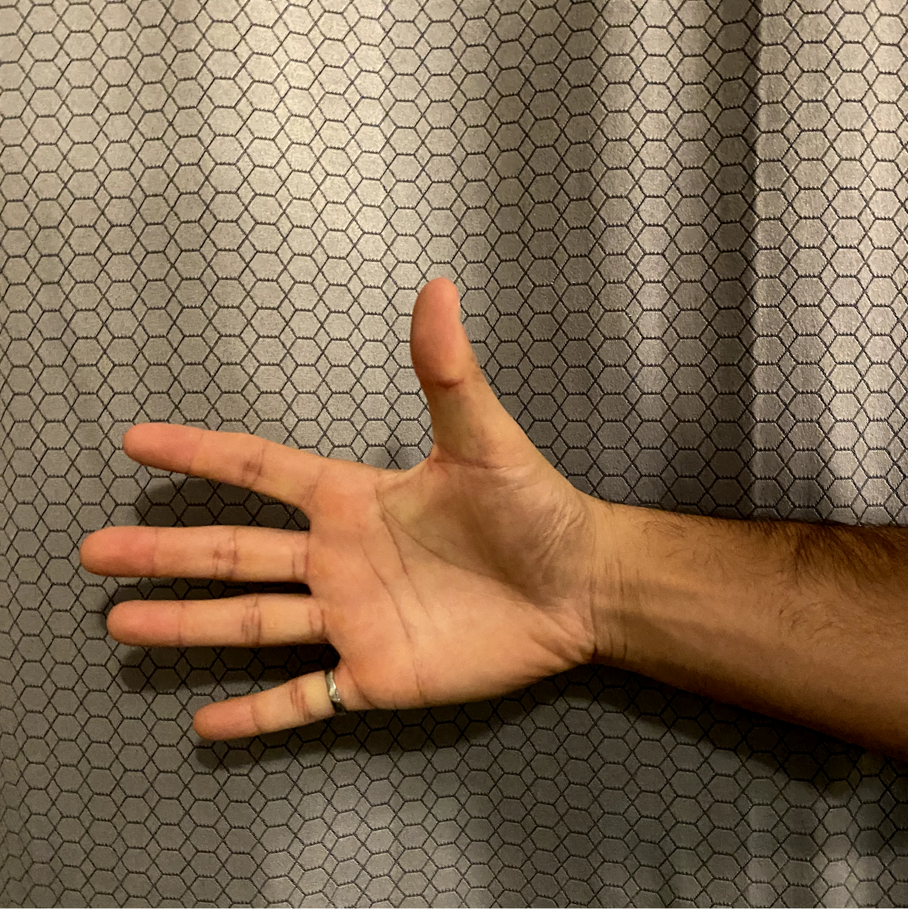   |    |
| 4  | Wrist Flexion |    |   |
| 5  | Wrist Extension |   | 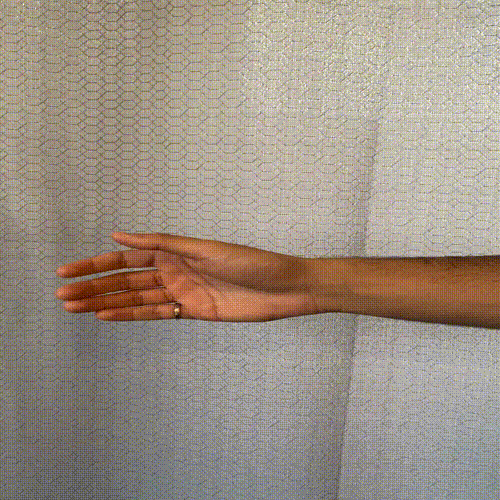  |
| 6  | Wrist Pronation |  | 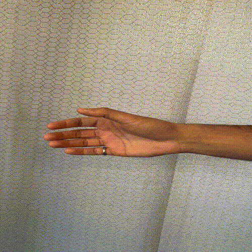 |
| 7  | Wrist Supination | | 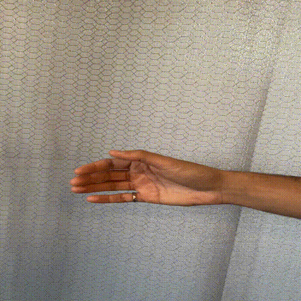  |
| 8  | Chuck Grip | 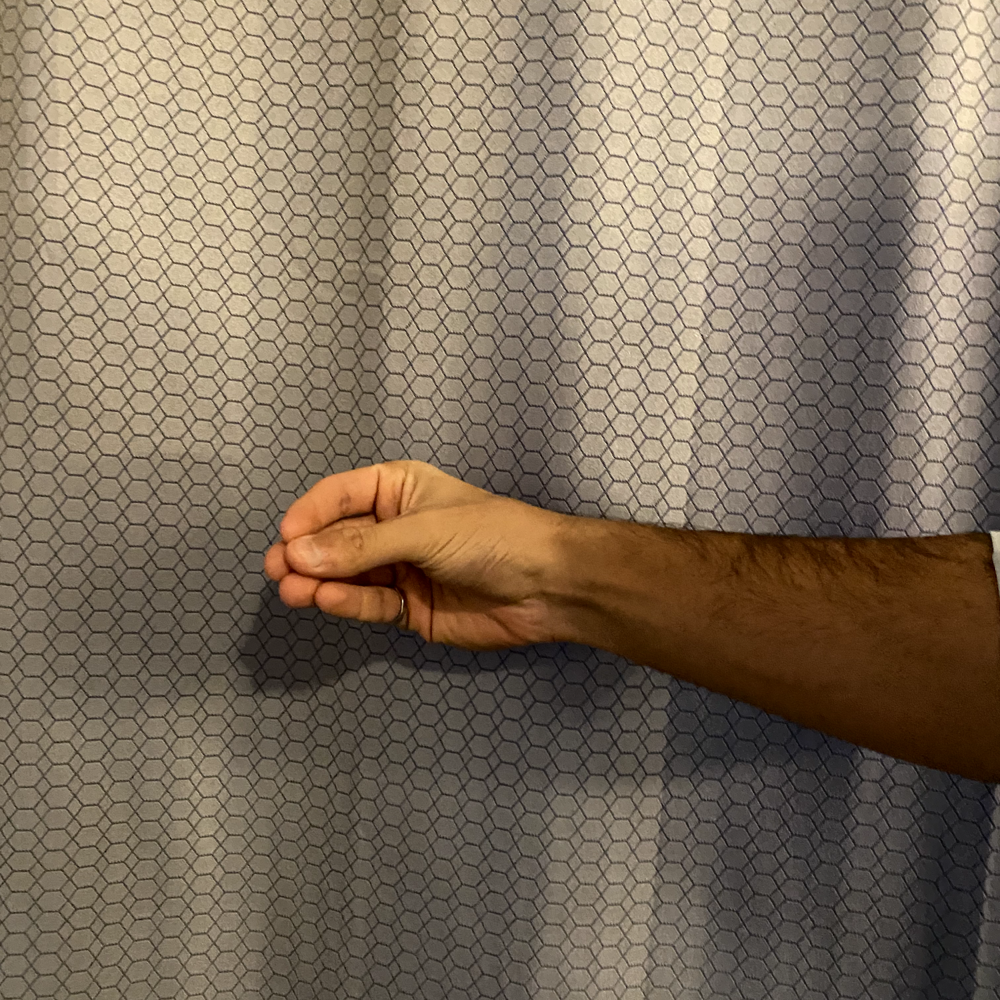  |   |
| 9  | Hang Loose |    |   |
| 10  | Peace |    |    |
| 11  | Scissors |    | 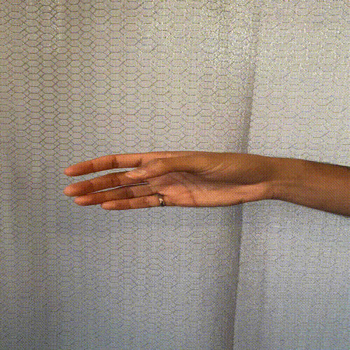   |
| 12  | Finger Gun 1 |    |    |
| 13  | Finger Gun 2 |    | 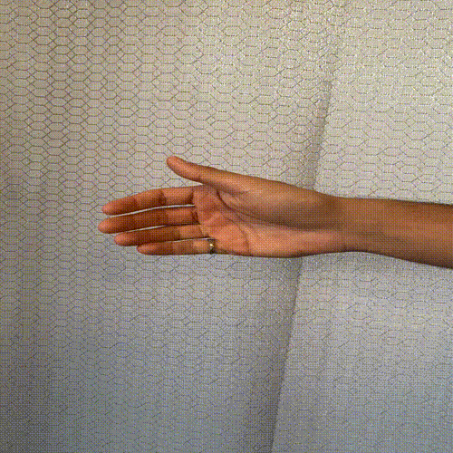  |
| 14  | Thumbs Up |    | 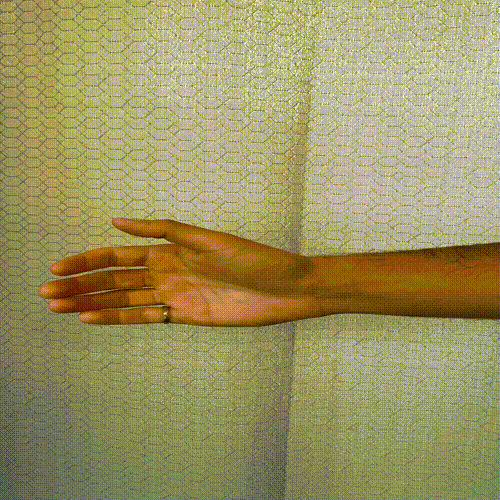 |
| 15  | Thumbs Down |    |    |
| 16  | "L" |    | 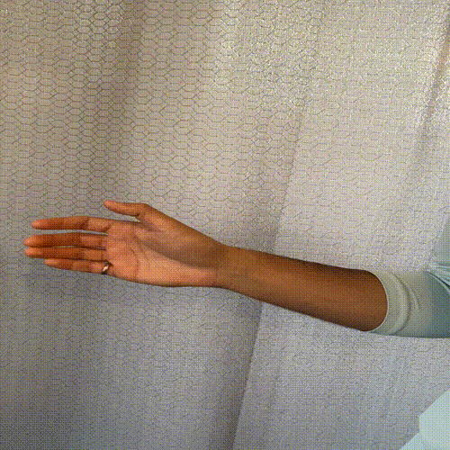   |
| 17  | Stop |    |    |
| 18  | OK |    |    |
| 19  | Rock On |    | 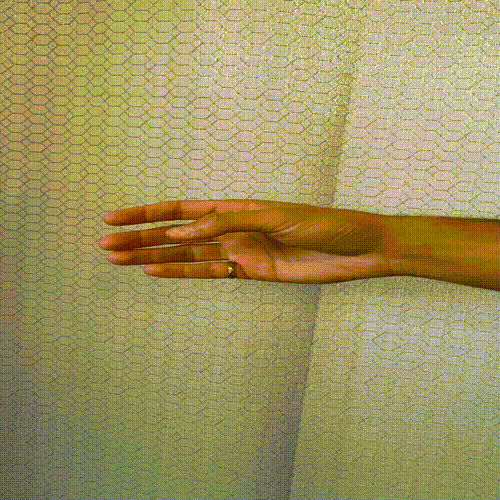  |
| 20  | Fingers Crossed |    | 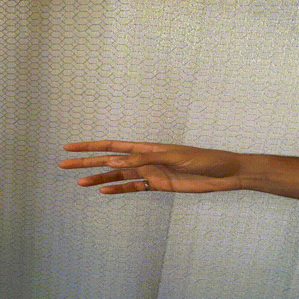   |
| 21  | Thumb Flexion |    | 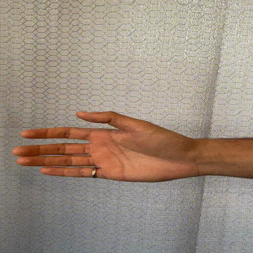   |
| 22  | Index Flexion |    |   |
| 23  | Middle Flexion |    | 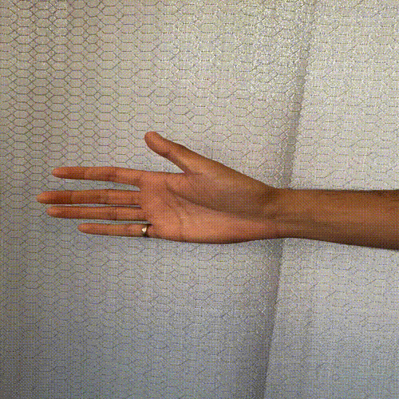   |
| 24  | Ring Flexion |    | 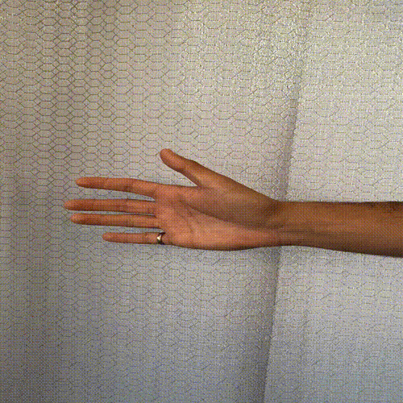  |
| 25  | Pinky Flexion |    | 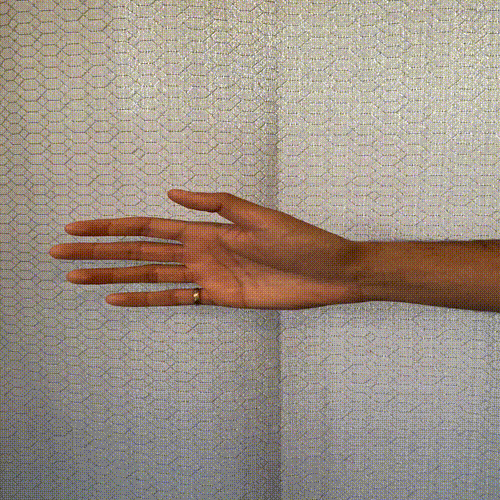 |
| 26  | Index Pinch |    | 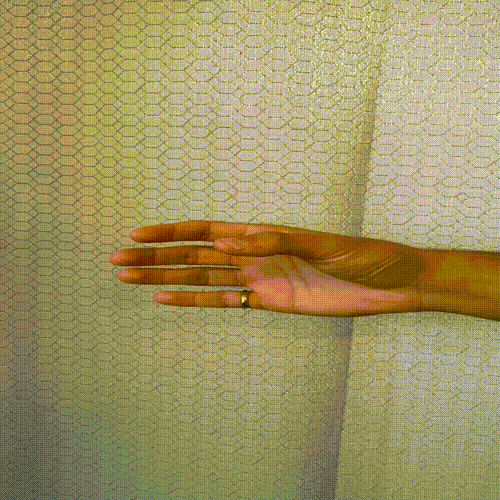   |
| 27  | Middle Pinch |    |   |
| 28  | Ring Pinch |    |    |
| 29  | Pinky Pinch |    |   |
| 30  | Index Extension |    | 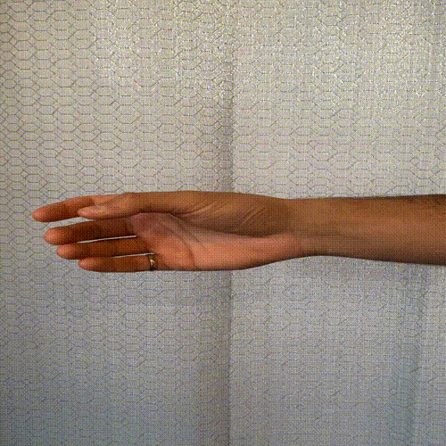  |
| 31  | Middle Extension |    | 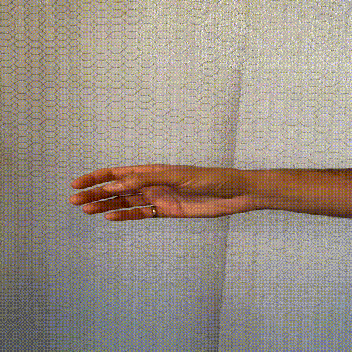  |
| 32  | Ring Extension |  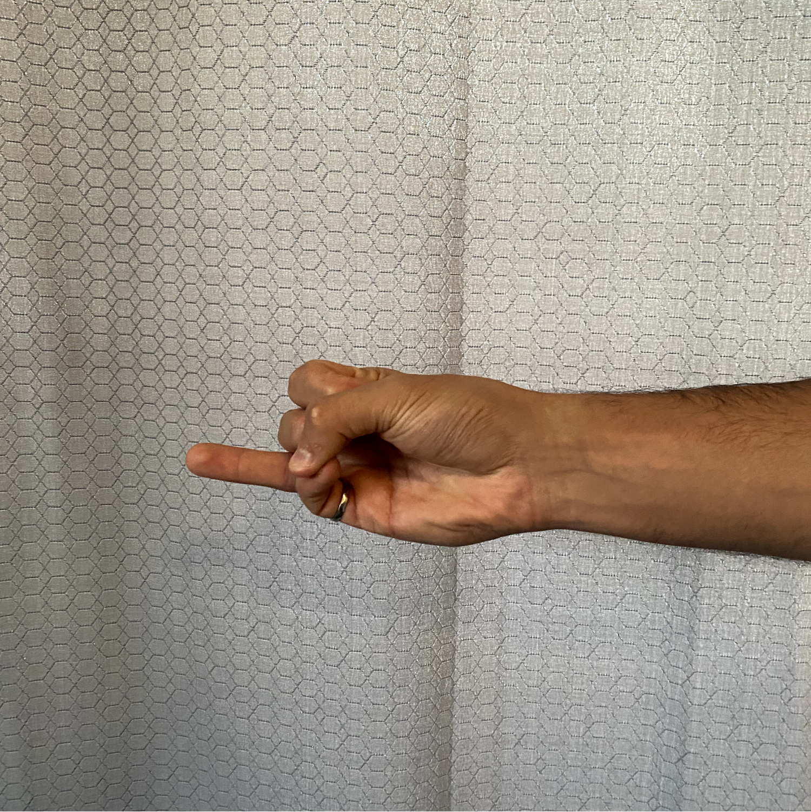  | 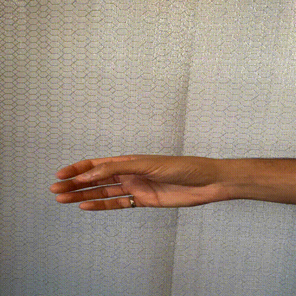  |
| 33  | Pinky Extension |    |  |
| 34  | A Little |    |   |
| 35  | Quotes |    |   |
